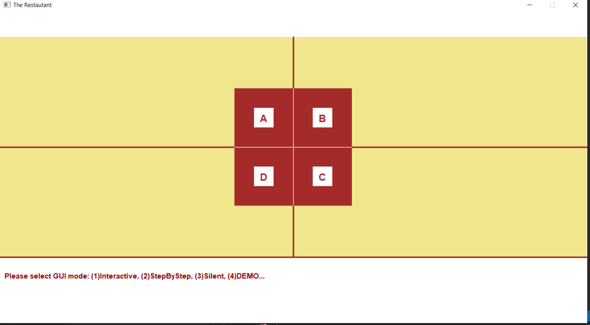

# Restaurant-Delivery

This is data structure and OOP project which organizes the delivery movement of a restaurant that has 4 branches (A, B, C, D).\
The project can work in 4 Modes.\

When an order arrives its number appears in its branch untill he was served.\
We have 3 types of Motorcycles with different speed, 3 types of Orders with different priorties, if two order has same priorty you have to choose one dependent on an equation of time and distance and money.\
Each branch has different number of Motorcycles.\
The client can Order, cancell order and promote order.\ 
The program reads the Event Data as file and at the end produces an output summary file with total orders served and money.\
